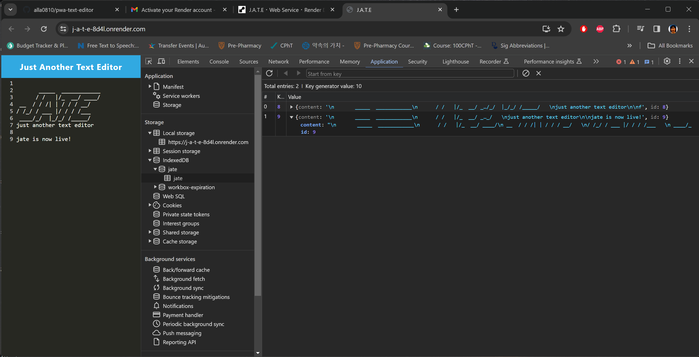

# PWA-TEXT-EDITOR  

## Description

This program is to create notes or code snippets with or without an internet connect to retrieve them for later use.

## Features

GIVEN a text editor web application

* WHEN you oepn your application in your editor, THEN you should see a client server folder structure

* WHEN you run `npm run start` from the root directory, THEN you find that your application should start up the backend and serve the client

* WHEN you run the tet editor application from your terminal, THEN you find that your JavaScript files have been bundled using webpack

* WHEN you you run your webpack plugins, THEN you find that you have a generated HTML file, service worker, and a manifest file

* WHEN you use next-gen JavaScript in your application, THEN you find that the text editor still functions in the browser without errors

* WHEN you open the text editor, THEN you find that IndexedDB has immediately created a database storage

* WHEN you enter content and subsequently click off of the DOM window, THEN you find that the content in the text editor has been saved with IndexedDB

* WHEN you reopen the text editor after closing it, THEN you find that the content in the text editor has been retrieved from our IndexdDB

* WHEN you click on the Install button, THEN you download your web application as an icon on your desktop

* WHEN you load your web application, THEN you should have a registered service worker using workbox

* WHEN you register a service worker, THEN you should have your static assets pre cached upon loading along with subsequent pages and static assets

* WHEN you deploy to Render, THEN you should have proper build scripts for a webpack application

## Installation on your local machine
After downloading from GitHub, you can run this program on your local machine by following the procedure below:
1. From a terminal, run `npm install` to install necessary packages.
2. Run `npm run start:dev` to run server on your `localhost:3000` port.
3. Open a brower and goto `localhost:3000` url.
4. You can use JEST on your local machine. 

## Access public JEST domain
You can access public JEST domain from the following url:
https://j-a-t-e-8d4l.onrender.com/

After installation, you can use JATE without internet connection.

## Technologies used
1. Express.js (https://expressjs.com/)
2. concurrently (https://www.npmjs.com/package/concurrently)
3. nodemon (https://www.npmjs.com/package/nodemon)
4. webpack (https://webpack.js.org/) 
5. CodeMirror Themes (https://codemirror.net/5/index.html)
6. idb (https://javascript.info/indexeddb)
7. Babel (https://babeljs.io/)

## Source Code References
  This project has used some reference codes from the following sites

   * https://git.bootcampcontent.com/University-of-Texas-at-Austin/UTA-VIRT-FSF-PT-07-2023-U-LOLC.git   

## Contact
  * Author: Kyosook Shin
  * Author's Email: kyosook.shin@gmail.com  
  * GitHub: https://github.com/alla0810/pwa-text-editor
  * Deployed at: https://j-a-t-e-8d4l.onrender.com/

## Screenshot  

  
  
